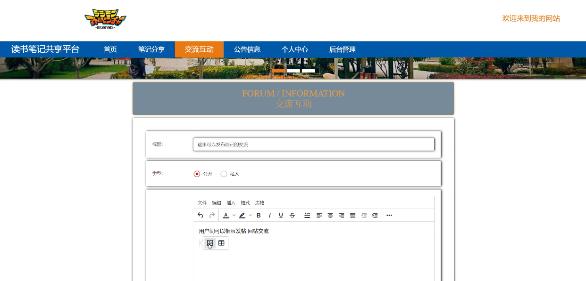

**项目简介：**  
本项目基于主流的前后端分离架构，采用 **SpringBoot + Vue 技术栈**，配套 **MySQL 数据库**，适用于毕业设计与课题实训开发。  
本人已整理了超 **4000 多套毕业设计源码+论文+开题报告+PPT...**，涵盖 **Java、SpringBoot、Vue、SSM、uni-app 小程序、PHP、Android** 等方向，支持功能修改定制与论文服务。  
**团队提供以下服务：**  
- 项目代码修改与调试  
- 数据库配置与远程协助  
- 论文定制与修改  
**获取更多的4000多套源码或SQL文件请联系：**  
- QQ：3906443360 微信：BesheHelp

## Springboot017学生读书笔记共享

**项目简介：**  
本项目基于主流的前后端分离架构，采用 **SpringBoot + Vue 技术栈**，配套 **MySQL 数据库**，适用于毕业设计与课题实训开发。  
本人已整理了超 **4000 多套毕业设计源码+论文+开题报告+PPT...**，涵盖 **Java、SpringBoot、Vue、SSM、uni-app 小程序、PHP、Android** 等方向，支持功能修改定制与论文服务。  
**团队提供以下服务：**  
- 项目代码修改与调试  
- 数据库配置与远程协助  
- 论文定制与修改  
**获取更多的4000多套源码或SQL文件请联系：**  
- QQ：3906443360 微信：BesheHelp**

# 系统实现与系统测试

# 第5章 系统实现

管理员、用户登录功能是系统中一个非常重要的功能模块。这个函数模块需要做的第一件事是设计系统的安全性。不能说任何打开登录界面的人都可以进入系统。我们想控制管理。用户的账号和密码，只有拥有权限的用户才能通过这个登录界面进入系统管理界面，这是非常重要的。用户想要登录和使用系统首先进入登录账户和登录密码，然后我们使用程序来检索，检索数据库中的账户信息一致输入账号密码，如果输入账号信息让用户登录时，如果它不存在，给一个提示,非法登陆，所以这个功能模块是非常重要的。

5.1管理员功能模块

管理员通过点击后台管理，进入页面可以输入用户名、密码、角色进行登录相对应操作，如图5-1所示。

图5-1管理员登录界面

管理员首页：管理员通过在管理员首页进入页面可以查看首页、个人中心、用户管理、笔记分享管理、个人笔记管理、管理员管理、交流互动、系统管理等功能模块，进行相对应操作，如图5-2所示。

图5-2管理员首页界面

用户管理：管理员通过在用户管理进入页面可以查看用户名、姓名、性别、头像、手机、邮箱、兴趣标签等并进行详情、删除、修改操作如图5-3所示。

图5-3用户管理界面

笔记分享管理：管理员在通过笔记分享管理进入页面可以查看笔记名称、笔记类型、笔记标签、笔记图片、分享日期、用户名、邮箱、审核回复、审核状态等信息，并进行详情、删除、修改操作，如图5-4所示。

图5-4笔记分享管理界面

管理员管理：管理员在通过管理员管理页面可以查看索引、用户名、密码、角色、操作等信息并进行详情、删除、修改操作如图5-5所示。

图5-5管理员管理界面

个人笔记管理：管理员在通过个人笔记管理页面可以查看笔记名称、笔记类型、笔记标签、笔记图片、发布日期、用户名、邮箱等信息，并进行详情、删除、修改操作，如图5-6所示。

图5-6个人笔记管理界面

交流互动：管理员在通过交流互动页面可以查看帖子标题、用户名、状态、操作等信息，并进行详情、删除、修改操作如图5-7所示。

图5-7交流互动界面

公告信息：管理员通过公告信息页面可以查看索引、标题、简介、图片、操作等信息，并进行详情、删除、修改操作如图5-8所示。

图5-8公告信息界面

5.2前台首页功能模块

登录进前台首页信息管理可以查看首页、笔记分享、交流信息、个人中心、后台管理等内容，如图5-9所示。

图5-9前台首页界面图

登录、用户注册，在用户注册页面可以填写用户名、姓名、性别、头像、手机、邮箱、兴趣标签等信息进行注册，如图5-10所示。

图5-10登录、用户注册界面图

笔记分享，在笔记分享页面通过填写笔记名称、笔记类型、笔记标签、笔记图片、分享日期、用户名、邮箱、审核回复、审核状态等信息进行搜索、添加，如图5-11所示。

图5-11笔记分享界面图

交流互动，在交流互动页面通过填写帖子标题、用户名、状态、操作

等信息进行公开、私人操作，如图5-12所示。

图5-12交流互动界面图

5.3用户功能模块

用户首页，在用户首页页面可以查看首页、个人中心、笔记分享管理、个人笔记管理、我的收藏管理等信息，如图5-13所示。

图5-13用户首页界面

个人信息，用户通过个人信息可以填写用户名、姓名、性别、头像、手机、邮箱、兴趣标签等信息，如图5-14所示。

图5-14个人信息界面图

笔记分享管理，用户通过笔记分享管理可以查看笔记名称、笔记类型、笔记标签、笔记图片、分享日期、用户名、邮箱、审核回复、审核状态等信息，进行详情修改或删除，如图5-15所示。

图5-15笔记分享管理界面图

个人笔记管理，用户通过个人笔记管理可以查看笔记名称、笔记类型、笔记标签、笔记图片、发布日期、用户名、邮箱等信息操作，如图5-16所示。

图5-16个人笔记管理界面图

